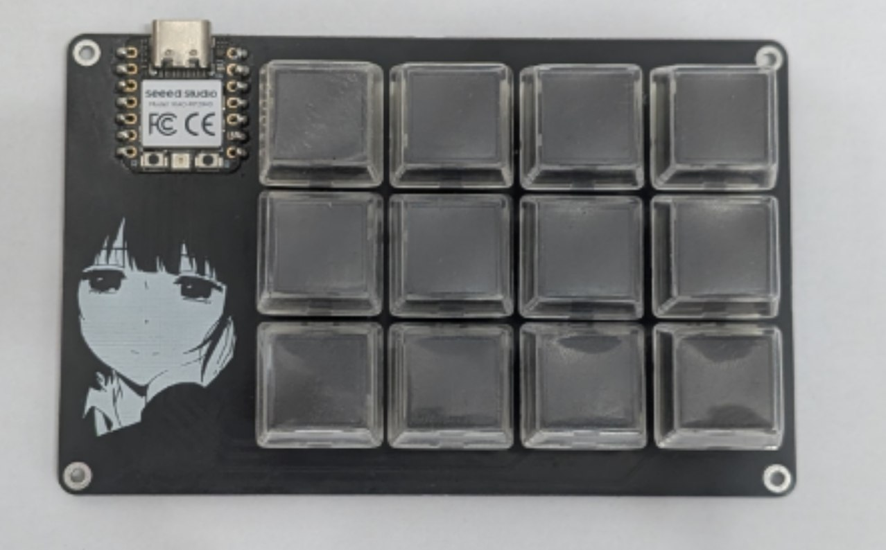

# RP2040 4×3 Keypad



A compact, 12-key USB keypad built around the Seeed Studio XIAO RP2040. It supports QMK and Vial, with configurable keyboard keys, macros, and 12 custom joystick buttons.

## Getting started

- **Use the supplied firmware:** go to [Flash a prebuilt UF2](#flash-a-prebuilt-uf2). No build tools are required.
- **Change keys without compiling:** flash the Vial firmware and follow [Configure the keypad with Vial](#configure-the-keypad-with-vial).
- **Build your own firmware:** follow [Set up the build environment](#set-up-the-build-environment).
- **Build the hardware:** see [Parts and assembly](#parts-and-assembly) and [Enclosure](#enclosure).

## Repository contents

| Path | Contents |
|---|---|
| [`firmware/src/`](firmware/src/) | QMK keyboard definition and `default` / `vial` keymaps |
| [`firmware/build/`](firmware/build/) | Prebuilt UF2 files |
| [`pcb/`](pcb/) | Gerber archive, BOM, pick-and-place data, and EasyEDA Pro project |
| [`enclosure/`](enclosure/) | FreeCAD source and STEP models for the two case parts |
| [`images/`](images/) | Project photos |

The firmware folder is linked into the build tree under the name **`rp2040_3x4_keypad`**. The supplied UF2 files have shorter names; this does not change the keyboard name used in build commands.

## Parts and assembly

### Electronic components

The quantities below come from [`BOM_RP2040_Keypad.csv`](pcb/BOM_RP2040_Keypad.csv).

| Quantity | Component | PCB reference | Notes |
|---:|---|---|---|
| 12 | `1N4148W` diode, SOD-123 | `D1`–`D12` | BOM supplier reference: LCSC `C917030` |
| 12 | Compatible 5-pin MX-style mechanical switch | `S1`–`S12` | Any compatible brand; |
| 1 | Seeed Studio XIAO RP2040 module | `XIAO-RP2040` | BOM footprint: `XIAO-RP2040-DIP` |

You will also need:

- One PCB, manufactured from [`Gerber_RP2040_Keypad.zip`](pcb/Gerber_RP2040_Keypad.zip).
- 12 keycaps compatible with the selected switches, if desired.
- The top and bottom enclosure parts.
- Fasteners suitable for the enclosure. The PCB has four M2 mounting holes; confirm screw lengths and whether nuts, inserts, or standoffs are needed against the CAD model.
- A USB-C cable that supports data transfer.
- A soldering iron, solder, flux, and tweezers for the SMD diodes.

The BOM does not specify the case fasteners, keycaps, USB cable, or controller mounting headers. Choose these to suit the actual assembly.

### Suggested assembly sequence

1. Solder the 12 diodes, matching each cathode marking to the PCB marking.
2. Fit and solder the XIAO RP2040 in the orientation shown by the PCB footprint. Check USB access and case clearance before fixing it in place.
3. Test-fit the switches and top case part before soldering the switches; the case may need to be installed first depending on the fit.
4. Solder all 12 switches and inspect the joints for bridges.
5. Flash the firmware and test every key before closing the enclosure.
6. Fit the PCB and case parts, secure the appropriate fasteners, and install the keycaps.

## Enclosure

| File | Purpose |
|---|---|
| [`enclosure.FCStd`](enclosure/enclosure.FCStd) | Editable FreeCAD model |
| [`enclosure-top.step`](enclosure/enclosure-top.step) | Top part |
| [`enclosure-bottom.step`](enclosure/enclosure-bottom.step) | Bottom part |

Open the FreeCAD source to modify the design, or import the STEP parts into your CAD software. Export each part as STL or 3MF if your slicer does not accept STEP.

Before printing, check the switch openings, PCB clearance, USB-C opening, and mounting features. Print both parts and test-fit them before final assembly. Print settings and fastener dimensions are not specified in this repository, so select them for your printer, material, and fit.

## Flash a prebuilt UF2

Choose one of the supplied files:

| Firmware | Use |
|---|---|
| [Download `4x3_keypad_default.uf2`](https://raw.githubusercontent.com/eone666/keypad/main/firmware/build/4x3_keypad_default.uf2) | Fixed QMK keymap |
| [Download `4x3_keypad_vial.uf2`](https://raw.githubusercontent.com/eone666/keypad/main/firmware/build/4x3_keypad_vial.uf2) | Runtime remapping in Vial and custom joystick button support |

Download the actual UF2 file, rather than saving its GitHub preview page. QMK, Vial QMK, and QMK Toolbox are not needed to copy an existing UF2.

### Download from a browser or terminal

Use the direct download links above in your browser, or run one of the commands below. Each command saves a UF2 in the current directory; download only the variant you need. These URLs serve the files published on the repository's `main` branch.

With **curl**:

```sh
# Default QMK firmware.
curl --fail --location --output 4x3_keypad_default.uf2 \
  https://raw.githubusercontent.com/eone666/keypad/main/firmware/build/4x3_keypad_default.uf2

# Vial firmware.
curl --fail --location --output 4x3_keypad_vial.uf2 \
  https://raw.githubusercontent.com/eone666/keypad/main/firmware/build/4x3_keypad_vial.uf2
```

With **wget**:

```sh
# Default QMK firmware.
wget --output-document=4x3_keypad_default.uf2 \
  https://raw.githubusercontent.com/eone666/keypad/main/firmware/build/4x3_keypad_default.uf2

# Vial firmware.
wget --output-document=4x3_keypad_vial.uf2 \
  https://raw.githubusercontent.com/eone666/keypad/main/firmware/build/4x3_keypad_vial.uf2
```

The examples above use shell line continuations for QMK MSYS, Linux, or macOS. In Windows PowerShell, use `curl.exe` on one line:

```powershell
curl.exe --fail --location --output 4x3_keypad_vial.uf2 https://raw.githubusercontent.com/eone666/keypad/main/firmware/build/4x3_keypad_vial.uf2
```

After downloading, copy the file from your download directory to `RPI-RP2` as described below. The later copy examples use the files included in a local repository checkout.

### Enter the RP2040 bootloader

1. Disconnect USB.
2. Hold the **BOOT / B** button on the XIAO RP2040.
3. Connect USB while holding the button, then release it.
4. Wait for a removable drive named **`RPI-RP2`** to appear.

If the device is already connected, hold **BOOT / B**, press and release **RESET / R**, then release BOOT. See the [XIAO RP2040 bootloader instructions](https://wiki.seeedstudio.com/XIAO-RP2040/).

A reset by itself normally restarts the firmware. Double-tap RESET is not enabled in the current project sources; it requires an explicit [QMK RP2040 configuration option](https://docs.qmk.fm/platformdev_rp2040).

### Copy the firmware

Copy the selected `.uf2` onto `RPI-RP2` using Explorer (Windows), Finder (macOS), or your Linux file manager. The drive disappears and the keypad restarts when flashing finishes.

Command-line examples, run from this repository:

```powershell
# Windows: replace E: with the actual RPI-RP2 drive letter.
Copy-Item .\firmware\build\4x3_keypad_vial.uf2 E:\
```

```sh
# macOS
cp firmware/build/4x3_keypad_vial.uf2 /Volumes/RPI-RP2/

# Linux: replace this with the actual mount point.
cp firmware/build/4x3_keypad_vial.uf2 "/media/$USER/RPI-RP2/"
```

After rebooting, open a text editor and test all 12 keys. Both source keymaps initially use:

```text
Q W E R
A S D F
Z X C V
```

These are QMK key positions; the characters produced depend on the host keyboard layout.

## Set up the build environment

There are three separate pieces:

- **QMK tools** provide the compiler and build commands.
- **Vial QMK** is the firmware fork required to build the `vial` keymap.
- **Vial desktop application** configures an already-flashed keypad.

Use upstream QMK for `default`, or Vial QMK for either `default` or `vial`. Do not build the Vial keymap in an upstream QMK checkout.

### 1. Install QMK tools

On **Windows**, install [QMK MSYS](https://msys.qmk.fm/) and open its terminal. Run the shell commands below in QMK MSYS, not PowerShell.

On **macOS or Linux**, install the QMK CLI and platform prerequisites using the OS-specific steps in the [official QMK setup guide](https://docs.qmk.fm/newbs_getting_started). Then run:

```sh
qmk setup -H ~/qmk_firmware
qmk doctor
```

Allow setup to install the required dependencies and resolve any errors reported by `qmk doctor`.

### 2. Get this project

If you already have a checkout, use its absolute path and skip cloning.

```sh
git clone https://github.com/eone666/keypad.git ~/keypad
```

The examples below assume `~/keypad`. For an existing Windows checkout, QMK MSYS uses paths such as `/c/Projects/keypad`. Replace example paths with your actual checkout location.

### 3. Install Vial QMK

For Vial builds, clone the fork alongside upstream QMK:

```sh
git clone https://github.com/vial-kb/vial-qmk.git ~/vial-qmk
cd ~/vial-qmk
make git-submodule
```

Keep `vial-qmk` outside `qmk_firmware`. The fork and its submodules are required in addition to the QMK tools. See the [Vial build guide](https://get.vial.today/docs/porting-to-vial.html).

### 4. Link the keyboard sources

Link **`firmware/src`**, not the entire repository or the `firmware` directory. The destination name defines the keyboard name used by QMK.

```sh
# Upstream QMK: default keymap.
ln -s "$HOME/keypad/firmware/src" \
  "$HOME/qmk_firmware/keyboards/rp2040_3x4_keypad"

# Vial QMK: default and vial keymaps.
ln -s "$HOME/keypad/firmware/src" \
  "$HOME/vial-qmk/keyboards/rp2040_3x4_keypad"
```

For an existing Windows checkout, replace the source argument with its MSYS path:

```sh
ln -s /c/Projects/keypad/firmware/src \
  "$HOME/vial-qmk/keyboards/rp2040_3x4_keypad"
```

On Windows, a native directory junction is another option. Run this example in **PowerShell**, substituting the actual Vial QMK path:

```powershell
New-Item -ItemType Junction `
  -Path "C:\path\to\vial-qmk\keyboards\rp2040_3x4_keypad" `
  -Target "C:\Projects\keypad\firmware\src"
```

The destination must not already exist. Native symlinks may require Windows Developer Mode or an elevated terminal. Verify that the linked directory contains `keyboard.json`:

```sh
ls "$HOME/vial-qmk/keyboards/rp2040_3x4_keypad/keyboard.json"
```

Edits to this repository are now used directly by the build tree.

## Build firmware

The `make` commands below explicitly use the checkout you enter, avoiding ambiguity between QMK and Vial QMK.

### Default keymap

```sh
cd ~/qmk_firmware
make rp2040_3x4_keypad:default
```

You can also build `default` from `~/vial-qmk` with the same target.

### Vial keymap

```sh
cd ~/vial-qmk
make rp2040_3x4_keypad:vial
```

The expected filenames are `rp2040_3x4_keypad_default.uf2` and `rp2040_3x4_keypad_vial.uf2`. QMK normally copies the final UF2 to the checkout root; intermediate output lives in `.build/`. Use the output path printed by the build, or find it with:

```sh
find . -maxdepth 2 -name "rp2040_3x4_keypad_*.uf2"
```

To keep a newly built Vial image with the supplied artifacts:

```sh
# Run from ~/vial-qmk; adjust the source path if necessary.
cp rp2040_3x4_keypad_vial.uf2 \
  ~/keypad/firmware/build/4x3_keypad_vial.uf2
```

This replaces the existing prebuilt file. To flash the new build manually, follow [Flash a prebuilt UF2](#flash-a-prebuilt-uf2) using your newly generated file.

### QMK CLI alternative

Before using the CLI with Vial, select the correct firmware checkout:

```sh
qmk config user.qmk_home="$HOME/vial-qmk"
cd ~/vial-qmk
qmk env
qmk compile -kb rp2040_3x4_keypad -km vial
```

Check that `qmk env` points to `vial-qmk`. This setting persists; to return to upstream QMK, run `qmk config user.qmk_home="$HOME/qmk_firmware"`. See [Vial first-time setup](https://get.vial.today/manual/first-use.html).

## Build and flash from the terminal

Enter bootloader mode so that `RPI-RP2` is mounted, then run the appropriate command:

```sh
# Default firmware.
cd ~/qmk_firmware
make rp2040_3x4_keypad:default:flash

# Vial firmware.
cd ~/vial-qmk
make rp2040_3x4_keypad:vial:flash
```

With the CLI configured to the correct checkout, the equivalent Vial command is:

```sh
qmk flash -kb rp2040_3x4_keypad -km vial
```

These targets build and flash. To install an existing file without rebuilding, copy the UF2 to `RPI-RP2`. See [QMK RP2040 flashing](https://docs.qmk.fm/flashing#raspberry-pi-rp2040-uf2).

## Configure the keypad with Vial

1. Download the desktop application for your OS from [Vial Downloads](https://get.vial.today/download/) and install or unpack it.
2. Flash the **Vial** UF2 and wait for the keypad to reconnect in normal mode.
3. Open Vial and select the keypad.
4. Select a key on the displayed layout and assign a keyboard key, macro, layer action, or custom joystick button.
5. Test the new assignment. Changes are stored on the keypad; no rebuild is needed.

If Vial requests an unlock, follow its prompt while holding the first two keys of the top row: matrix positions **`[0,0]` and `[0,1]`** (initially Q and W). These positions are defined in `firmware/src/keymaps/vial/config.h`.

The custom keycodes **`GP_BTN1`–`GP_BTN12`** press and release USB joystick buttons 1–12. They are not assigned by default; select them in Vial to use the keypad as a button controller. Test them in the host game-controller settings or a joystick tester.

Save a layout backup in Vial before replacing firmware or resetting stored settings. Normal remapping does not require a reboot.

## Editing the firmware

| File | What to change |
|---|---|
| [`keyboard.json`](firmware/src/keyboard.json) | Matrix pins, USB IDs, layout definition, and QMK features |
| [`default/keymap.c`](firmware/src/keymaps/default/keymap.c) | Default fixed key assignments |
| [`vial/keymap.c`](firmware/src/keymaps/vial/keymap.c) | Initial Vial assignments and joystick button handlers |
| [`vial/config.h`](firmware/src/keymaps/vial/config.h) | Vial UID, unlock combination, and joystick button count |
| [`vial/rules.mk`](firmware/src/keymaps/vial/rules.mk) | Vial, VIA, and joystick build options |
| [`vial/vial.json`](firmware/src/keymaps/vial/vial.json) | Vial layout and custom keycode labels |

Rebuild and flash after changing source files. Existing Vial assignments may remain in nonvolatile storage, so changing the initial keymap does not necessarily replace the currently saved layout.

## Hardware reference

| Parameter | Value |
|---|---|
| Controller | XIAO RP2040 |
| Matrix | 3 rows × 4 columns |
| Row pins | `GP4`, `GP2`, `GP1` |
| Column pins | `GP29`, `GP6`, `GP7`, `GP0` |
| Diode direction | `COL2ROW` |
| Bootloader | RP2040 UF2 |
| USB VID / PID | `0x4144` / `0x3433` |

## Troubleshooting

| Problem | Check |
|---|---|
| Keyboard target not found | Confirm the link is named `rp2040_3x4_keypad` and points to `firmware/src` in the active checkout. |
| Vial build fails or Vial is missing after flashing | Build in `vial-qmk`, initialize submodules with `make git-submodule`, and flash the `vial` UF2. |
| Missing compiler or build dependencies | Run `qmk doctor` and complete the QMK environment setup. |
| `RPI-RP2` does not appear | Reconnect while holding BOOT; try another data cable and USB port. RESET alone does not enter the bootloader. |
| CLI flashes from the wrong checkout | Inspect `qmk env` and set `user.qmk_home` to the intended firmware tree. |
| Terminal flashing cannot find the drive | Confirm `RPI-RP2` is mounted, or copy the generated UF2 manually. |
| Vial cannot detect the keypad on Linux | Check the [Vial Linux udev instructions](https://get.vial.today/manual/linux-udev.html). |
| One key or an entire row/column does not work | Inspect switch joints, diode orientation, controller joints, and matrix connections. |
| Source keymap changes do not appear | Check whether a saved Vial layout is overriding the initial assignments. Back it up before resetting settings. |

## Contributing

Contributions are welcome: firmware improvements, new keymaps, PCB revisions, enclosure changes, clearer documentation, and build reports.

For bugs, open an [issue](https://github.com/eone666/keypad/issues) describing what you expected, what happened, and how to reproduce it. Include the relevant firmware/keymap, operating system, and build output or photos where useful. Remove personal paths and other sensitive details from logs before sharing them.

To propose a change:

1. Fork the repository and create a branch for your change.
2. Keep the change focused and update any affected documentation.
3. Verify the parts you changed using the checks below.
4. Open a [pull request](https://github.com/eone666/keypad/pulls) explaining the change and how you tested it. State clearly if hardware testing was not possible.

| Change | Suggested checks |
|---|---|
| Firmware | Build the affected keymaps; for shared keyboard changes, build both `default` and `vial`. Test key input, Vial remapping, and joystick buttons where relevant. |
| PCB | Include the editable project, update affected manufacturing files and BOM, and describe compatibility with the controller and enclosure. |
| Enclosure | Update the FreeCAD source and affected STEP exports. Check PCB fit, switch openings, USB access, and mounting features; include print or fit-test results if available. |
| Documentation | Check commands, relative links, file paths, and Markdown formatting. |

If you update a prebuilt UF2, include the source changes and record the QMK or Vial QMK revision and build command used to produce it. For substantial hardware or compatibility changes, open an issue first to discuss the approach.
